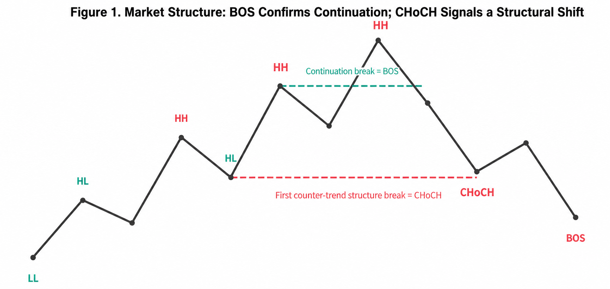
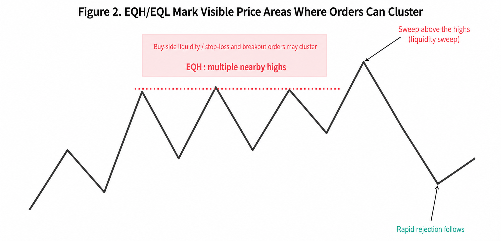
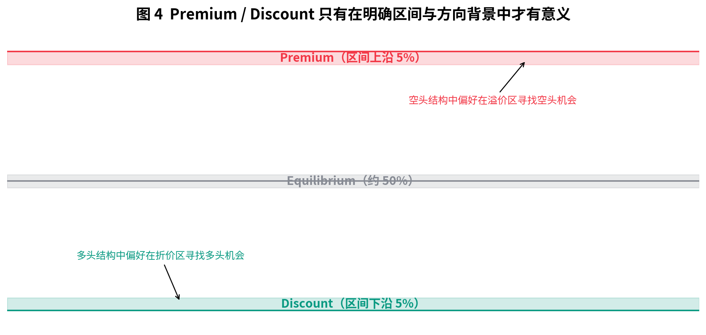

# moomoo Smart Money Suite

<p align="center">
  <strong>A three-module Smart Money Concepts indicator suite for the moomoo Python custom-indicator runtime</strong><br>
  Structure · Order Blocks · Fair Value Gaps · Premium / Discount
</p>

<p align="center">
  
  
  
  
</p>

<p align="center">
  
</p>

> [!IMPORTANT]
> This is an unofficial, non-commercial cross-platform adaptation. Its algorithms reference LuxAlgo's open-source Pine Script and have been reworked for moomoo's sequence API and client-observed limit of 50 static `plot*()` calls per indicator. This is not a LuxAlgo product and does not claim pixel-perfect parity with TradingView.

## Why three indicators?

In the tested moomoo Desktop Python custom-indicator compiler, a script containing more than 50 static `plot*()` calls is rejected. This is a client-observed constraint rather than a limit documented on moomoo's public website, and it may change in future releases.

Splitting the complete SMC system into three stackable modules preserves the main features while keeping responsibilities, settings, and plot budgets explicit.

| Indicator | Features | Static plot budget |
|---|---|---:|
| `SMC_STR` | Internal/swing structure, BOS, CHoCH, HH/HL/LH/LL, EQH/EQL, Strong/Weak levels, candle coloring | 28 / 50 |
| `SMC_OB` | Internal/swing order blocks, volatility filtering, mitigation, `iOB`/`sOB` labels | 50 / 50 |
| `SMC_IMB` | Current-chart-timeframe FVGs, auto threshold, Premium/Equilibrium/Discount, FVG labels | 46 / 50 |

## Quick installation

1. Open the custom indicator manager in moomoo Desktop.
2. Create three new **Python overlay indicators** and paste the complete contents of:
   - [`indicators/SMC_STR.py`](indicators/SMC_STR.py)
   - [`indicators/SMC_OB.py`](indicators/SMC_OB.py)
   - [`indicators/SMC_IMB.py`](indicators/SMC_IMB.py)
3. Name the indicators `SMC_STR`, `SMC_OB`, and `SMC_IMB` respectively.
4. Add all three to the same candlestick chart. Test them individually before using the combined layout.

> [!TIP]
> For the first validation, use a QCOM or TTWO daily chart. Check the Structure segment endpoints first, load Order Blocks second, and then enable FVGs and Premium/Discount Zones.

## What's new in v3.2

- ATR(200)-adaptive spacing for BOS, CHoCH, EQH/EQL, and Strong/Weak labels reduces line and candle overlap.
- Active order blocks now include `iOB` and `sOB` labels while preserving mitigation behavior.
- FVGs include direction-colored labels, with support for up to 20 active zones and 20 labels within the plot budget.
- Structure segments use independent stickline primitives to prevent `plot()` from joining separate events with diagonal lines.
- The repository includes a complete Chinese SMC handbook in Markdown, PDF, and editable Word formats, plus four original diagrams.

## Visual guide

| Liquidity · EQH/EQL | Order Blocks · FVG |
|---|---|
|  |  |

| Premium · Equilibrium · Discount |
|---|
|  |

## Suggested settings and troubleshooting

If Structure labels remain crowded, gradually increase the following ATR multiples. These settings move text only; they do not change event dates or price levels.

```text
Internal Label Gap ATR = 0.45
Swing Label Gap ATR    = 0.55
EQ Label Gap ATR       = 0.45
```

For full parameter descriptions, terminology, trading workflows, and risk management, see:

- [Chinese Smart Money Concepts handbook — Markdown](docs/Smart_Money_Concepts_实战手册_CN.md)
- [Chinese handbook — PDF](docs/Smart_Money_Concepts_实战手册_CN.pdf)
- [Chinese handbook — editable Word](docs/Smart_Money_Concepts_实战手册_CN.docx)
- [Detailed v3.2 notes in Chinese](docs/README_V3_2_CN.md)

## Differences from the TradingView original

The project aims to align the core state, pivot, BOS/CHoCH, order-block, FVG, EQH/EQL, and value-zone algorithms. Some differences are unavoidable because of platform capabilities:

- moomoo uses static sequence rendering and cannot reproduce Pine's dynamic `line`, `label`, and `box` object management exactly.
- FVG detection supports the current chart timeframe only; the client-confirmed Python runtime does not expose an arbitrary equivalent of Pine's `request.security()`.
- Previous Day/Week/Month High-Low levels are not included in the current three modules.
- Historical state scans are explicitly capped at 500 bars to fit the available runtime and rendering model.
- The moomoo Desktop client remains the authoritative compiler and renderer.

See the full [compatibility matrix](docs/COMPATIBILITY.md).

## LuxAlgo reference and attribution

This repository adapts and modifies the following open-source work:

- Original work: **Smart Money Concepts (SMC) [LuxAlgo]**, © LuxAlgo
- Official publication: [TradingView open-source script](https://www.tradingview.com/script/CnB3fSph-Smart-Money-Concepts-SMC-LuxAlgo/)
- Pinned source baseline: [Pine v5 mirror at `31756c8615aff4cefe9cf97350e78bd427f663cd`](https://github.com/deepentropy/lightweight-charts-indicators/blob/31756c8615aff4cefe9cf97350e78bd427f663cd/docs/official/indicators_community/Smart%20Money%20Concepts%20%28SMC%29%20%5BLuxAlgo%5D.pine)
- Original and adapted-work license: [CC BY-NC-SA 4.0](https://creativecommons.org/licenses/by-nc-sa/4.0/)

Material changes include the Pine v5 to moomoo Python/`ftool` port, the three-module architecture, static sequence-state reconstruction, platform-specific segment rendering, adaptive label spacing, and additional OB/FVG labels. See [NOTICE.md](NOTICE.md) for the complete attribution and modification notice.

LuxAlgo, TradingView, moomoo, and Futu names and trademarks belong to their respective owners. This repository is not affiliated with, endorsed by, or sponsored by any of them.

## Risk disclosure

SMC indicators cannot directly identify the real orders of banks, funds, or institutional accounts. They use public OHLC data to organize observations about market structure, liquidity, and price imbalance. Everything in this repository is provided for education, research, and technical validation only. It is not investment advice, and past performance does not guarantee future results.

## License

Under the terms of the original work, this adaptation is released under the **Creative Commons Attribution-NonCommercial-ShareAlike 4.0 International** license. You must preserve attribution, use the material only for non-commercial purposes, and distribute adaptations under the same license. See [LICENSE](LICENSE) and [NOTICE.md](NOTICE.md).
