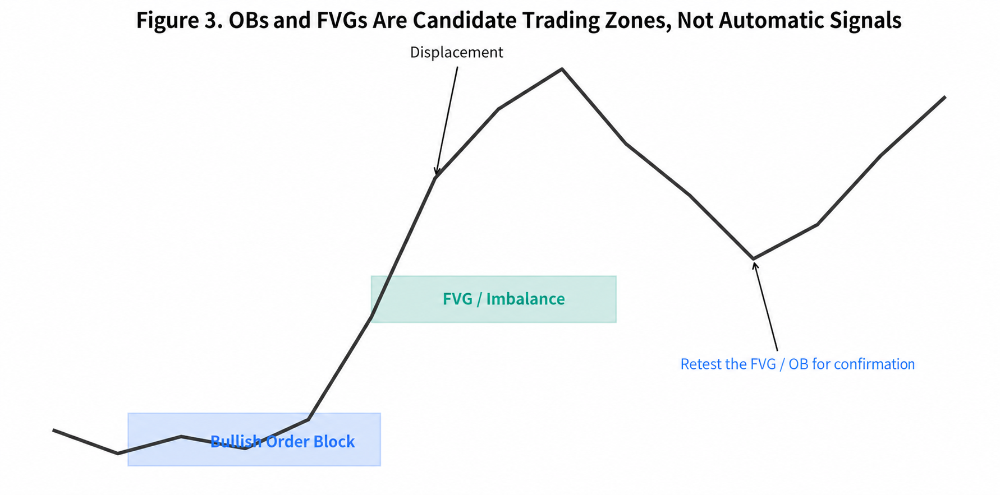
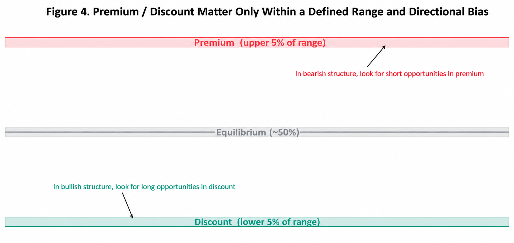

# Smart Money Concepts（SMC）结构、流动性与交易区域实战手册

**适用版本：** moomoo 自定义指标 `SMC_STR`、`SMC_OB`、`SMC_IMB` v3.2  
**参考基线：** LuxAlgo 开源 Smart Money Concepts Pine v5 脚本  
**用途：** 理解指标含义、正确阅读图表、配置参数、建立可测试的交易流程  

> **版本提示：** 概念与交易流程仍适用；当前代码已升级到内存优化 v4.1。绘图预算、实现边界和默认标签间距请以 [`../releases/V4_1_CN.md`](../releases/V4_1_CN.md) 为准。

> **最重要的结论**  
> SMC 不是“机构持仓探测器”。它无法从普通 OHLC K 线中识别某笔交易究竟来自基金、做市商、散户还是算法。更准确的说法是：SMC 是一套以**市场结构、流动性位置、位移和价格回补区域**为核心的价格行为框架。它试图从公开价格留下的结果中，推断哪里可能发生过显著的供需失衡，哪里可能聚集止损、突破单和待成交限价单。

---

## 目录

1. SMC 到底是什么，以及不是什么  
2. 为什么价格图表可能留下“大资金足迹”  
3. 市场结构基础：HH、HL、LH、LL  
4. BOS 与 CHoCH：延续确认和结构转向  
5. Internal 与 Swing Structure：微观结构和主结构  
6. Strong / Weak High-Low：当前结构最可能攻击哪里  
7. EQH / EQL 与流动性池  
8. Order Block：候选供需区，而不是机构订单原件  
9. Fair Value Gap：位移留下的三根 K 线不平衡  
10. Premium、Equilibrium、Discount  
11. Previous Day / Week / Month High-Low  
12. LuxAlgo 指标的具体算法逻辑  
13. moomoo 三模块的参数说明  
14. 一套完整的自上而下使用流程  
15. 三类典型交易模型  
16. 常见误区与失效场景  
17. 回测、复盘和风险管理  
18. 快速术语表  
19. 参考资料

---

# 1. SMC 到底是什么，以及不是什么

## 1.1 SMC 是一种价格行为语言

Smart Money Concepts 把价格走势描述成几个相互关联的层次：

- **结构**：市场是在持续抬高高低点，还是持续降低高低点；
- **结构突破**：既有结构被延续还是被反向破坏；
- **流动性**：明显高低点、等高等低、前日高低等位置可能聚集条件单；
- **位移**：价格是否用大实体、连续推进和缺口式结构快速离开某一区域；
- **交易区域**：Order Block、FVG、Premium/Discount 等位置是否与方向背景一致。

LuxAlgo 的公开说明将其 SMC 指标定位为自动标注 Internal/Swing BOS、CHoCH、Order Blocks、EQH/EQL、FVG、前高前低与 Premium/Discount 的工具，而不是一个自动盈利系统。[1]

## 1.2 SMC 不是直接的“聪明钱探测器”

单凭 K 线，你看不到：

- 订单的真实账户属性；
- 隐藏单、冰山单和暗池成交的完整信息；
- 机构是建仓、对冲、套利还是被动指数再平衡；
- 同一价格反应究竟来自信息交易、流动性枯竭还是普通新闻冲击。

因此，“Order Block 里一定有机构未成交订单”“FVG 一定会回补”“扫流动性就是庄家故意打止损”都属于过度解释。LuxAlgo 自己也明确指出，这类概念不能保证交易者正在面对真实的银行级或机构流动性，相关教学本身缺乏足够数据证明。[1][2]

更稳妥的表述是：

> SMC 用价格结构作为代理变量，寻找可能具有较高订单密度、较强历史反应或更合理风险收益比的区域。

---

# 2. 为什么价格图表可能留下“大资金足迹”

SMC 虽然不是机构识别技术，但它背后的部分直觉与市场微观结构研究并不冲突。

## 2.1 大订单通常不能一次完成

大型参与者若一次性用市价单完成巨大头寸，会消耗订单簿深度并显著推高交易成本。最优执行研究把执行问题描述为在**市场冲击、交易成本和价格风险**之间权衡；现实中的大订单因此常被拆分为一系列子订单。[3][4]

这种拆单会带来两个可观察结果：

1. 同方向订单流可能具有持续性；
2. 价格对某些区域的反应可能不是一次完成，而是多次推进、回踩和再次推进。

这为“趋势结构”“回踩候选区域”提供了合理的微观机制，但并不能证明某个具体 BOS 或 OB 一定由单一机构造成。

## 2.2 订单流失衡会推动价格

Cont、Kukanov 和 Stoikov 对美国股票订单簿事件的研究发现，短时间价格变化与最佳买卖盘附近的订单流失衡存在稳定关系，且市场深度越浅，同等失衡造成的价格影响越大。[5]

这解释了为什么以下现象值得观察：

- 连续大实体推进；
- 突破前高或前低后的加速；
- 薄弱流动性区域中的快速穿越；
- 在高深度区域或显著历史水平附近的停顿。

SMC 把这些结果重新组织成 BOS、CHoCH、FVG、OB 等图形语言。

## 2.3 明显水平附近可能聚集条件单

Osler 对外汇订单的研究记录了止损单和止盈单在某些技术水平附近的聚集，并发现价格突破止损聚集区后更容易出现快速的正反馈运动。[6][7]

这为 EQH/EQL、前高前低和“流动性扫过”提供了一种可检验的解释：

- 明显高点上方可能聚集空头止损和突破买单；
- 明显低点下方可能聚集多头止损和突破卖单；
- 一旦这些条件单被触发，短期订单流可能突然同向增加。

但要注意：这类证据最直接来自外汇订单数据，不能无条件推广到所有股票、期货、加密资产和所有周期。

## 2.4 “Smart Money”最合理的理解

在实战中，把 Smart Money 理解成“更有耐心、更有规模、更关注流动性和执行成本的参与者行为”比理解成某个神秘集团更有用。

SMC 指标真正能做的是：

- 识别结构方向；
- 标出潜在订单集中区域；
- 提醒价格出现了位移或结构变化；
- 帮助你把入场、失效和目标写成明确规则。

它不能做的是证明“机构正在这里买入”。

---

# 3. 市场结构基础：HH、HL、LH、LL

## 3.1 四个基础摆动点

| 缩写 | 中文 | 定义 | 常见含义 |
|---|---|---|---|
| HH | Higher High | 新高高于前一确认高点 | 多头仍有能力推进 |
| HL | Higher Low | 回调低点高于前一确认低点 | 多头回调未破坏主结构 |
| LH | Lower High | 反弹高点低于前一确认高点 | 空头压制仍在 |
| LL | Lower Low | 新低低于前一确认低点 | 空头仍有能力推进 |

典型多头结构是：

> HH → HL → HH → HL

典型空头结构是：

> LL → LH → LL → LH

## 3.2 摆动点不是实时确定的

任何可靠的 swing pivot 都需要未来 K 线确认。LuxAlgo 的 `leg(size)` 逻辑会在当前 K 线观察 `size` 根之前的高低点是否高于/低于随后窗口，并在确认后把标签画回真正的 pivot K 线。[8]

因此：

- 图上 HH/HL 看起来出现在很早的位置；
- 但交易当时并不知道它已经确认；
- `Swing Length=50` 的摆动点要等待较长时间才确认；
- 历史图上存在明显的“视觉后见性”。

正确复盘必须记录**确认时间**，而不只看标签回画的位置。

---

# 4. BOS 与 CHoCH

## 4.1 BOS：Break of Structure

BOS 表示价格沿当前结构方向突破一个尚未被突破的确认 pivot。

在多头 bias 下：

- 收盘价上穿当前确认高点；
- 结构方向仍是多头；
- 标记为 bullish BOS。

在空头 bias 下：

- 收盘价下穿当前确认低点；
- 结构方向仍是空头；
- 标记为 bearish BOS。

BOS 的用途不是预测突破必然延续，而是回答：

> 当前方向是否再次获得价格确认？

## 4.2 CHoCH：Change of Character

CHoCH 是当前 bias 的首次反向结构突破。

例如：

1. 先前最后一次有效结构事件为 bullish；
2. 价格随后收盘跌破当前确认低点；
3. 该次反向突破标记为 bearish CHoCH；
4. bias 切换为空头；
5. 后续继续向下突破才会标记 bearish BOS。

因此 CHoCH 更像**转向预警**，不是单独的反转确认。

## 4.3 为什么 BOS/CHoCH 有时很多

LuxAlgo 同时计算两种结构：

- **Internal Structure**：长度固定为 5，敏感、频繁、使用虚线和小标签；
- **Swing Structure**：默认长度 50，缓慢、代表更大级别结构、使用实线和较大标签。[1][8]

要降低噪声，可以：

- 开启 `Confluence Filter`；
- Internal Bull/Bear 选择 `BOS only`；
- 完全关闭 Internal Structure；
- 提高 Swing Length；
- 使用 Present Mode 只看最新结构。

## 4.4 实战解读顺序

不要把任何 CHoCH 直接等同于反转。更稳健的顺序是：

1. 大级别 Swing bias；
2. 价格到达流动性或高时间框架区域；
3. 出现反向 Internal CHoCH；
4. 出现位移；
5. 回踩 OB/FVG；
6. 再用 BOS 或微观结构确认。

---

# 5. Internal 与 Swing Structure

## 5.1 Internal Structure

Internal 结构用于捕捉主趋势内部的短期变化。优点是早，缺点是噪声大。

适合：

- 低周期入场触发；
- 判断回调是否开始加速；
- 在已知高时间框架区域内寻找精细确认。

不适合：

- 单独决定日线或周线方向；
- 在横盘中机械交易每一个 CHoCH；
- 忽略成本和假突破。

## 5.2 Swing Structure

Swing 结构描述更大的市场腿。它确认较慢，但更适合定义：

- 主 bias；
- 大级别失效点；
- Premium/Discount 区间；
- Strong/Weak High-Low；
- Swing Order Block。

## 5.3 多周期结构嵌套

一个常见状态是：

- 日线 Swing 多头；
- 4 小时正在回调；
- 1 小时 Internal 空头；
- 15 分钟在 Discount + Bullish OB 附近形成 bullish CHoCH。

这不矛盾。它表示：

> 大结构仍多头，中级别正在回调，低级别刚出现结束回调的早期迹象。

---

# 6. Strong / Weak High-Low

LuxAlgo 会从最近确认的 swing pivot 开始维护 trailing top 和 trailing bottom，并根据当前 Swing bias 给出：

- Swing bias 多头：`Weak High` + `Strong Low`；
- Swing bias 空头：`Strong High` + `Weak Low`。[8]

其逻辑是：

- 多头结构仍有继续制造新高的倾向，当前高点更容易被攻击，因此称 Weak High；
- 多头结构若成立，当前 trailing low 是关键防守位置，因此称 Strong Low。

“Strong”并不表示绝对不会被破坏；“Weak”也不表示价格一定马上去扫。它描述的是**当前结构下的相对脆弱性**。

---

# 7. EQH / EQL 与流动性池

## 7.1 定义

EQH 是两个确认摆动高点的价格差足够小；EQL 是两个确认摆动低点的价格差足够小。

LuxAlgo 默认：

- Bars Confirmation = 3；
- Threshold = 0.1；
- 判断条件近似为：

\[
|P_{current}-P_{previous}| < 0.1\times ATR(200)
\]

实际阈值可调整。[8]

## 7.2 为什么等高等低值得关注

等高和等低非常醒目，容易形成共同参照：

- 交易者把止损放在高点上方或低点下方；
- 突破交易者把条件单放在这些水平外侧；
- 做市与套利算法可能根据可见流动性调整报价；
- 价格到达该区域时，短期可执行订单量可能上升。

因此 EQH/EQL 更适合作为**潜在目标和事件位置**，而不是直接入场点。

## 7.3 Sweep 与真正突破

常见区别：

- **Sweep**：影线越过 EQH/EQL，随后快速收回；
- **Break**：收盘站稳外侧，并继续形成结构延续；
- **Absorption**：多次测试后仍无法离开，可能存在吸收，但仅靠 K 线不能确认真实被动订单。

---

# 8. Order Block

## 8.1 SMC 中的常见解释

Bullish OB 常被描述为上涨位移前最后一个显著下跌区域；Bearish OB 则是下跌位移前最后一个显著上涨区域。

但 LuxAlgo 的实际算法比这句口号更具体：

1. 结构发生 bullish 或 bearish break；
2. 在 pivot 到 break 之间扫描经过波动过滤后的高低点；
3. Bullish OB 选择最低 `parsedLow` 所在 K 线；
4. Bearish OB 选择最高 `parsedHigh` 所在 K 线；
5. 用该 K 线的 parsedHigh/parsedLow 构成区块；
6. 区块被 High/Low 或 Close 穿越后删除。[8]

所以该脚本中的 OB 不一定是“突破前最后一根反向 K 线”。

## 8.2 ATR 与 Cumulative Mean Range 过滤

高波动 K 线可能严重扩大 OB。LuxAlgo 提供：

- `ATR`；
- `Cumulative Mean Range`。

较新源码在检测高波动 K 线后，会交换 parsedHigh 与 parsedLow，使其在极值扫描中失去成为宽大区块的优势，而不是简单删除整根 K 线。[8]

## 8.3 Mitigation

两种常用方式：

- `High/Low`：Bullish OB 被最低价跌破 bottom 后失效；Bearish OB 被最高价突破 top 后失效；
- `Close`：必须由收盘价穿越才失效。

High/Low 更敏感，Close 更宽松。

## 8.4 OB 为什么可能有效

可能机制包括：

- 位移起点附近曾经发生明显订单流失衡；
- 大订单分批执行，价格回到原区域时可能再次遇到同方向需求；
- 市场参与者共同看到该区域，形成自我实现式反应；
- 该区域通常可定义清晰失效点，因此吸引风险受限交易者。

但 OB 不等于尚未成交机构订单。真正订单可能已经完成、撤销、对冲或在其他场所成交。

## 8.5 正确使用 OB

把 OB 当作 `POI（Point of Interest）`：

- 需要方向背景；
- 最好与流动性事件、位移、FVG、Premium/Discount 重合；
- 等待低级别确认；
- 失效点必须明确；
- 不要对每个区块挂单。

---

# 9. Fair Value Gap（FVG）

## 9.1 三根 K 线定义

Bullish FVG 的核心形式：

\[
Low_t > High_{t-2}
\]

且中间 K 线收盘与涨幅通过方向和 Auto Threshold 过滤。Bearish FVG 则相反。[8]

它表示三根 K 线中，第一根高点与第三根低点之间没有发生价格重叠，常见于快速位移。

## 9.2 FVG 代表什么

更准确的解释是：

- 价格在该区间快速通过；
- 双边交易和停留时间相对有限；
- 后续回到该区域时，市场可能重新寻找成交平衡。

这不意味着每个 FVG 都必须完全回补。

## 9.3 Consequent Encroachment

FVG 中点常被称为 Consequent Encroachment（CE），可作为：

- 回踩深度参考；
- 部分止盈或入场分层；
- 判断回补是否过深的中间线。

LuxAlgo 源码将一个 FVG 分成上下两个 box，但使用相同颜色，视觉上仍是一整块区域。[8]

## 9.4 FVG 失效

LuxAlgo：

- Bullish FVG：价格最低点低于 bottom 后删除；
- Bearish FVG：价格最高点高于 top 后删除。[8]

注意这是一种脚本定义，不是所有 SMC 流派的统一标准。

---

# 10. Premium、Equilibrium、Discount

这三个区域来自当前 trailing swing range：

- Premium：顶部至 95/5 分界；
- Equilibrium：52.5/47.5 附近的窄区；
- Discount：5/95 分界至底部。[8]

其直觉是：

- 多头背景中，更偏好在 range 下半部寻找多头；
- 空头背景中，更偏好在 range 上半部寻找空头；
- Equilibrium 是区间中性区域。

但“便宜”和“昂贵”只相对于选定 range。若 range 选错，Premium/Discount 就没有意义。

---

# 11. Previous Day / Week / Month High-Low

前日、前周、前月高低点常被用作：

- 高时间框架流动性目标；
- 日内开盘后的方向参考；
- 突破和失败突破判断；
- 止盈与失效位置。

LuxAlgo 使用 `request.security()` 读取高时间框架数据并把真实极值位置延伸到右侧。[8]

当前 moomoo Python 指标运行时尚未验证出可靠的任意跨周期 OHLC 请求接口，所以当前三模块未提供等价的 MTF 功能。不要用“固定 N 根 K 线约等于一天”代替，因为不同市场交易时段、节假日、盘前盘后都会导致错误。

---

# 12. LuxAlgo 指标的具体算法逻辑

## 12.1 Pivot / Leg

对于长度 `size`：

- 若 `high[size] > highest(size)`，识别为新的 bearish leg 起点，即确认高点；
- 若 `low[size] < lowest(size)`，识别为新的 bullish leg 起点，即确认低点；
- leg 状态切换时更新 pivot；
- Internal 固定 `size=5`；
- Swing 默认 `size=50`；
- EQH/EQL 使用独立 `size=3`。[8]

## 12.2 Structure Break

- 使用 `close` 上穿/下穿 pivot level；
- 每个 pivot 只允许一次有效 break；
- 反向于上一 bias 的第一次 break 是 CHoCH；
- 同方向后续 break 是 BOS；
- Internal 还要求 Internal level 与 Swing level 不同；
- Confluence Filter 用突破 K 线的上下影关系过滤部分 Internal break。[8]

## 12.3 Present 与 Historical

- Historical：保留所有历史结构线和标签；
- Present：删除前一个同类对象，只显示最新结构对象。

在 moomoo 中没有 Pine 动态对象，因此使用序列化线段模拟。行为尽量等价，但无法把对象真正延伸到未来空白区域。

## 12.4 重要后见性提示

- Pivot 标签回画到过去；
- EQH/EQL 需要后续 K 线确认；
- Order Block 是在结构 break 后才确定；
- 仍 active 的 OB/FVG 会删除已失效历史对象；
- 只看当前图可能产生 survivorship bias。

因此策略回测必须使用事件确认时刻，而不是图上标签所在的历史 K 线。

---

# 13. moomoo 三模块参数说明

# 13.1 `SMC_STR`

| 参数 | 含义 | 建议 |
|---|---|---|
| Mode: Present | True 只保留最新结构；False 显示历史 | 实盘清爽用 True，研究用 False |
| Style: Monochrome | 单色主题 | 个人偏好 |
| Color Candles | 按 Internal bias 重画 K 线 | 容易遮挡原 K 线，默认关闭 |
| Show Internal Structure | 显示微观结构 | 低周期确认用 |
| Internal Bull/Bear Mode | 0 All / 1 BOS / 2 CHoCH | 降噪可设 1 |
| Confluence Filter | 过滤部分 Internal break | 建议实盘开启 |
| Show Swing Structure | 显示主结构 | 建议开启 |
| Swing Bull/Bear Mode | 0 All / 1 BOS / 2 CHoCH | 一般保留 All |
| Swing Length | 主结构敏感度 | 50 为源码默认；更大更慢 |
| Show Swing Points | HH/HL/LH/LL | 图表拥挤时关闭 |
| Show Strong/Weak H/L | 当前 trailing 目标与防守位 | 建议开启 |
| Equal High/Low | EQH/EQL | 建议开启 |
| EQ Bars Confirmation | 等高等低确认长度 | 默认 3 |
| EQ Threshold | 相对 ATR 灵敏度 | 越低越严格 |
| Internal/Swing/EQ Label Gap ATR | 标签离线距离 | 当前 v3.2 可直接调大 |

# 13.2 `SMC_OB`

| 参数 | 含义 | 建议 |
|---|---|---|
| Internal Order Blocks | 微观结构 OB | 默认开启 |
| Internal OB Count | 当前显示数量 1-20 | 3-5 较清爽 |
| Swing Order Blocks | 主结构 OB | 建议需要时开启 |
| Swing OB Count | 当前显示数量 | 2-5 |
| OB Filter | 0 ATR / 1 Cumulative Range | 默认 ATR |
| Mitigation | 0 High/Low / 1 Close | 源码默认 High/Low |
| Confluence Filter | 与 `SMC_STR` Internal 过滤保持一致 | 两模块必须一致 |
| Show OB Labels | 显示 `iOB` / `sOB` | v3.2 新增 |
| OB Label Count | 最近 0-5 个标签 | 受 50 plot 限制 |

**注意：** moomoo 单指标最多 50 个绘图通道。`SMC_OB` 已使用 40 个区域通道，因此最多再为最近 5 个 Internal 和 5 个 Swing OB 提供标签。超过 5 的区域仍会显示，但不再逐块加文字。

# 13.3 `SMC_IMB`

| 参数 | 含义 | 建议 |
|---|---|---|
| Fair Value Gaps | 当前周期 FVG | 源码默认关闭 |
| Auto Threshold | 过滤小型 FVG | 建议开启 |
| Extend FVG | FVG 向右延伸根数 | 默认 1 |
| FVG Render Cap | 最多显示当前 active FVG 数量 | 5-10 较清爽 |
| Show FVG Labels | 在区域中显示 FVG | v3.2 新增 |
| FVG Label Count | 加标签的 FVG 数量 | 可设 0-20 |
| Premium/Discount Zones | 显示价值区域 | 只在 range 有意义时开启 |
| Swing Length | 区间来源 | 与 `SMC_STR` 保持一致 |

v3.2 把 FVG 的上下两个同色填充通道合并为一个视觉等价区域，释放通道用于每个 FVG 的文字标签。

---

# 14. 一套完整的自上而下使用流程

## 步骤 1：先定义高时间框架背景

回答：

- Swing bias 是多头、空头还是混乱？
- 当前最可能被攻击的是 Weak High 还是 Weak Low？
- 价格位于 Premium、Equilibrium 还是 Discount？
- 附近是否有高时间框架 OB、FVG 或前高前低？

## 步骤 2：等待价格进入 POI

POI 可包括：

- Swing OB；
- Internal OB；
- FVG；
- EQH/EQL 外侧；
- Premium/Discount；
- 前日、前周、前月高低点。

不要在价格离所有 POI 很远时追逐信号。

## 步骤 3：观察流动性事件

常见事件：

- 扫过 EQH/EQL 后收回；
- 突破 Weak High/Low；
- 进入 OB 后快速拒绝；
- 触及 FVG 中点后出现位移。

## 步骤 4：等待低级别结构确认

例如多头模型：

1. 高时间框架多头；
2. 价格进入 Discount + Bullish OB；
3. 先扫 Sell-side Liquidity；
4. 低级别出现 bullish CHoCH；
5. 形成 bullish displacement 与 FVG；
6. 回踩 FVG/OB；
7. 入场并把失效放在结构低点外侧。

## 步骤 5：定义目标和失效

目标优先级可为：

- 最近 Internal Weak High/Low；
- EQH/EQL；
- 对侧 OB；
- Swing Weak High/Low；
- 前日、前周、前月高低点。

失效必须在入场前确定。若无法定义失效，该区域就不适合交易。

---

# 15. 三类典型交易模型

## 15.1 顺势回调模型

**条件：**

- Swing 多头；
- 价格回到 Discount；
- 触及 Bullish OB 或 Bullish FVG；
- Internal bearish 结构结束并出现 bullish CHoCH；
- 随后 bullish BOS。

**入场：** CHoCH 后形成的低级别 OB/FVG 回踩。  
**失效：** 回调低点或 Bullish OB bottom 下方。  
**目标：** Internal Weak High、EQH、Swing Weak High。

## 15.2 流动性扫过反转模型

**条件：**

- 价格进入高时间框架 Premium；
- 扫过 EQH 或前高；
- 快速收回并产生 bearish displacement；
- 低级别 bearish CHoCH；
- 回踩 Bearish OB/FVG。

**风险：** 扫过之后可能继续真突破，因此必须等待收盘和结构确认。

## 15.3 突破延续模型

**条件：**

- Swing 与 Internal 同向；
- 关键 level 被收盘突破形成 BOS；
- 位移明显；
- 突破后留下 FVG；
- 回踩不重新跌回旧结构内部。

**入场：** 回踩 FVG/OB，而不是追突破大阳线。  
**目标：** 下一流动性池或 Weak High/Low。

---

# 16. 常见误区与失效场景

## 16.1 每个 CHoCH 都交易

横盘内会不断出现 Internal CHoCH。没有高时间框架位置和位移配合时，它只是噪声。

## 16.2 把 OB 当作绝对支撑阻力

OB 会被直接穿透。区块越多，事后总能找到一个“反应过”的区域，容易产生选择偏差。

## 16.3 认为所有 FVG 都必须回补

强趋势可以留下长期未回补的 FVG；小 FVG 可能只是正常波动。Auto Threshold 有助于减少噪声，但不是保证。

## 16.4 忽视确认延迟

Swing、EQH/EQL 和 OB 都在未来 K 线出现后才确认。用回画位置做历史入场会产生未来函数偏差。

## 16.5 三个模块参数不一致

必须保持：

- `SMC_STR` 与 `SMC_OB` 的 Confluence Filter 一致；
- 三模块 Swing Length 一致；
- Monochrome 设置一致；
- 对比 TradingView 时 Mode、All/BOS/CHoCH、OB mitigation、FVG 开关必须一致。

## 16.6 忽视市场和周期差异

- 股票存在跳空、财报和隔夜信息；
- 外汇是近 24 小时连续市场；
- 加密资产没有统一收盘；
- 低流动性标的容易产生异常 FVG 和宽 OB；
- 日线与 1 分钟结构的统计属性完全不同。

---

# 17. 回测、复盘和风险管理

## 17.1 把 SMC 变成策略需要六个明确规则

1. 交易市场与周期；
2. bias 定义；
3. POI 定义；
4. 入场触发；
5. 止损与退出；
6. 仓位和最大风险。

“看到 OB 就买”不是完整策略。

## 17.2 建议记录字段

| 字段 | 示例 |
|---|---|
| 高时间框架 bias | 日线 Swing 多头 |
| 目标流动性 | 前高 / EQH |
| POI | 4H Bullish OB + Discount |
| 触发 | 15m bullish CHoCH + FVG |
| 入场 | FVG 50% |
| 失效 | sweep low 下方 |
| 目标 | Internal Weak High / Swing Weak High |
| R 倍数 | +2.4R |
| 最大有利/不利波动 | MFE / MAE |
| 是否按确认时刻执行 | 是/否 |

## 17.3 风险原则

- 每笔风险固定，而不是固定股数；
- 结构失效越远，仓位越小；
- 同方向多个相关标的要合并风险；
- 财报、重大宏观数据前降低杠杆；
- 不因为“机构区域”而取消止损；
- 先验证样本外表现，再决定是否实盘。

---

# 18. 快速术语表

| 术语 | 含义 |
|---|---|
| BOS | 顺当前结构方向的确认突破 |
| CHoCH | 当前 bias 的首次反向结构突破 |
| MSS | Market Structure Shift，部分流派中与 CHoCH 相近但定义不完全统一 |
| HH / HL | 更高高点 / 更高低点 |
| LH / LL | 更低高点 / 更低低点 |
| Internal Structure | 固定短长度的微观结构 |
| Swing Structure | 更大长度的主结构 |
| Buy-side Liquidity | 高点上方可能聚集的买单与空头止损 |
| Sell-side Liquidity | 低点下方可能聚集的卖单与多头止损 |
| EQH / EQL | 等高 / 等低，潜在流动性池 |
| Sweep | 短暂越过流动性水平后收回 |
| Displacement | 快速、大幅、方向明确的价格位移 |
| Order Block | 与结构 break 相关的候选供需区域 |
| Mitigation | 价格重新进入或穿越区块，使其被视为已处理/失效 |
| FVG | 三根 K 线形成的非重叠不平衡区 |
| CE | FVG 中点 Consequent Encroachment |
| Premium | 当前 range 上端的相对高价区域 |
| Discount | 当前 range 下端的相对低价区域 |
| Equilibrium | 当前 range 中性区 |
| POI | Point of Interest，候选交易区域 |
| MTF | Multi-Timeframe，多周期 |

---

# 19. 结语：怎样正确理解“追踪 Smart Money”

SMC 指标追踪的不是某个机构账户，而是以下公开结果：

- 价格结构是否持续或反转；
- 哪些水平容易聚集条件单；
- 哪些区域曾出现明显订单流失衡；
- 哪些位置能形成清晰的失效和目标。

市场微观结构研究支持“订单流影响价格”“大订单会拆分”“止损可能聚集并引发价格级联”等一般机制。[3][4][5][6] 但这些研究并没有证明某个特定 OB、FVG 或 CHoCH 算法能稳定识别机构行为。

因此最专业的用法是：

> 把 SMC 当作结构化假设生成器；用方向背景、位置、确认、风险控制和统计验证决定是否交易。

---

# 参考资料

[1] LuxAlgo, *Smart Money Concepts (SMC) [LuxAlgo]*, TradingView open-source indicator, updated 2025.  
https://www.tradingview.com/script/CnB3fSph-Smart-Money-Concepts-SMC-LuxAlgo/

[2] LuxAlgo Library, *Smart Money Concepts (SMC)*.  
https://www.luxalgo.com/library/indicator/smart-money-concepts-smc/

[3] Albert S. Kyle, “Continuous Auctions and Insider Trading,” *Econometrica*, 1985, 53(6), 1315-1335.  
https://www.econometricsociety.org/publications/econometrica/browse/1985/11/01/continuous-auctions-and-insider-trading

[4] Jean-Philippe Bouchaud, J. Doyne Farmer, Fabrizio Lillo, “How Markets Slowly Digest Changes in Supply and Demand,” 2008.  
https://arxiv.org/abs/0809.0822

[5] Rama Cont, Arseniy Kukanov, Sasha Stoikov, “The Price Impact of Order Book Events,” *Journal of Financial Econometrics*, 2014, 12(1), 47-88.  
https://academic.oup.com/jfec/article-abstract/12/1/47/816163

[6] Carol L. Osler, “Currency Orders and Exchange Rate Dynamics: An Explanation for the Predictive Success of Technical Analysis,” *Journal of Finance*, 2003.  
https://onlinelibrary.wiley.com/doi/abs/10.1111/1540-6261.00588

[7] Carol L. Osler, “Stop-loss Orders and Price Cascades in Currency Markets,” *Journal of International Money and Finance*, 2005, 24(2), 219-241.  
https://www.newyorkfed.org/medialibrary/media/research/staff_reports/sr150.pdf

[8] LuxAlgo open Pine v5 source mirror, commit `31756c8615aff4cefe9cf97350e78bd427f663cd`, *Smart Money Concepts (SMC) [LuxAlgo].pine*.  
https://github.com/deepentropy/lightweight-charts-indicators/blob/31756c8615aff4cefe9cf97350e78bd427f663cd/docs/official/indicators_community/Smart%20Money%20Concepts%20(SMC)%20%5BLuxAlgo%5D.pine

---

**免责声明：** 本手册用于指标工程、市场结构研究与交易教育，不构成投资建议。所有 SMC 标记都是基于历史和当前价格计算的模型输出，可能延迟、误判或在不同数据源上产生差异。任何实盘使用都应经过独立回测、样本外验证和严格风险控制。
